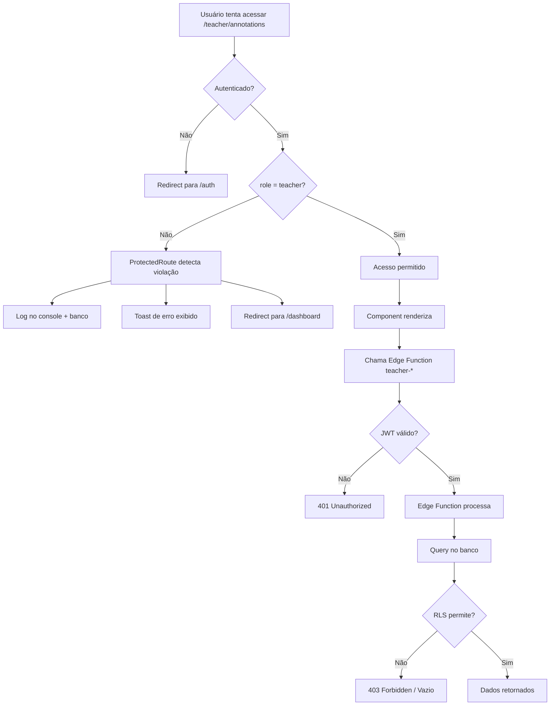

# Arquitetura de Segurança - Sistema de Anotações

## 📋 Visão Geral

Este documento descreve a arquitetura de segurança implementada para garantir a separação completa entre funcionalidades de **estudantes** e **professores** no sistema de anotações.

## 🎯 Princípios de Segurança

### 1. **Separação por Role**
- **Dois perfis distintos:** `student` e `teacher`
- **Sem compartilhamento de código:** Frontend, backend e processamento completamente isolados
- **Validação em múltiplas camadas:** Cliente, servidor e banco de dados

### 2. **Zero Trust Architecture**
- Nunca confiar apenas em validações client-side
- Sempre validar permissões no servidor (Edge Functions)
- RLS (Row Level Security) como última linha de defesa no banco de dados

---

## 🗂️ Separação de Funcionalidades

### **Frontend - Rotas Isoladas**

#### **Estudantes:**
- **Rotas:** `/annotations`, `/annotation/:id`
- **Páginas:** 
  - `src/pages/MyAnnotationsPage.tsx`
  - `src/pages/AnnotationPage.tsx`
- **Proteção:** `<ProtectedRoute role="student">`

#### **Professores:**
- **Rotas:** `/teacher/annotations`, `/teacher/annotation/:id`
- **Páginas:**
  - `src/pages/TeacherAnnotationsPage.tsx`
  - `src/pages/TeacherAnnotationPage.tsx`
- **Proteção:** `<ProtectedRoute role="teacher">`

### **Backend - Edge Functions Separadas**

#### **Estudantes:**
| Função | Propósito | Contexto |
|--------|-----------|----------|
| `generate-annotation-title` | Gerar títulos de anotações | Foco acadêmico/estudantil |
| `generate-annotation-tags` | Gerar tags automáticas | Categorias de estudo |
| `ai-text-formatting` | Ações de IA no conteúdo | Resumir, explicar, melhorar |

#### **Professores:**
| Função | Propósito | Contexto |
|--------|-----------|----------|
| `generate-teacher-annotation-title` | Gerar títulos pedagógicos | Foco didático |
| `generate-teacher-annotation-tags` | Gerar tags pedagógicas | Categorias de ensino |
| `teacher-ai-text-formatting` | Ações de IA pedagógicas | Criar rubrica, plano de aula, atividades |

**Diferenças críticas:**
- ✅ Prompts e contextos completamente diferentes
- ✅ Categorias de tags distintas (`TEACHER_CATEGORIES` vs `STUDENT_CATEGORIES`)
- ✅ Ações de IA personalizadas para cada perfil

### **Database - Isolamento por RLS**

#### **Tabela Compartilhada:** `annotations`

**Colunas:**
```sql
- id: uuid
- user_id: uuid (chave de isolamento)
- title: text
- content: text
- tags: text[]
- source_id: text
- source_type: text
- created_at: timestamptz
- updated_at: timestamptz
```

#### **Políticas RLS (Row Level Security):**

```sql
-- SELECT: Usuários só veem suas próprias anotações
CREATE POLICY "Users can view their own annotations"
ON annotations FOR SELECT
USING (auth.uid() = user_id);

-- INSERT: Usuários só criam anotações para si mesmos
CREATE POLICY "Users can create their own annotations"
ON annotations FOR INSERT
WITH CHECK (auth.uid() = user_id);

-- UPDATE: Usuários só editam suas próprias anotações
CREATE POLICY "Users can update their own annotations"
ON annotations FOR UPDATE
USING (auth.uid() = user_id);

-- DELETE: Usuários só deletam suas próprias anotações
CREATE POLICY "Users can delete their own annotations"
ON annotations FOR DELETE
USING (auth.uid() = user_id);
```

**Garantia:**
- 🔒 Estudantes **NUNCA** veem anotações de professores
- 🔒 Professores **NUNCA** veem anotações de estudantes
- 🔒 Impossível burlar via API ou SQL direto

---

## 🛡️ Camadas de Proteção

### **Camada 1: Frontend (ProtectedRoute)**

**Arquivo:** `src/components/ProtectedRoute.tsx`

**Funcionalidades:**
1. **Validação de autenticação:**
   - Redireciona para `/auth` se não autenticado
   
2. **Validação de role:**
   - Verifica se `userRole` corresponde ao `role` exigido pela rota
   - Redireciona para dashboard apropriado se role incorreto

3. **Auditoria de segurança:**
   - Loga tentativas não autorizadas no **console**
   - Registra tentativas no banco de dados (`security_logs`)
   - Exibe **toast** informativo ao usuário

**Exemplo de log:**
```typescript
{
  attemptedRoute: '/teacher/annotations',
  attemptedRole: 'teacher',
  actualRole: 'student',
  userId: 'uuid-do-usuario',
  timestamp: '2024-01-15T10:30:00.000Z',
  userAgent: 'Mozilla/5.0...'
}
```

### **Camada 2: Backend (Edge Functions)**

**Validação JWT:**
- Todas as edge functions exigem `verify_jwt = true` no `supabase/config.toml`
- Token JWT contém `user_id` e `role` validados pelo Supabase Auth

**Verificações:**
```typescript
// Exemplo em generate-teacher-annotation-title
const authHeader = req.headers.get('Authorization');
if (!authHeader) {
  return new Response('Unauthorized', { status: 401 });
}

// JWT já validado pelo Supabase
// user_id extraído automaticamente
```

### **Camada 3: Database (RLS Policies)**

**Último nível de defesa:**
- Mesmo que frontend/backend sejam burlados, RLS bloqueia acesso cruzado
- `auth.uid()` é inviolável (vem do token JWT validado pelo Supabase)
- Queries maliciosas retornam vazio ou erro 403

---

## 📊 Monitoramento e Auditoria

### **Tabela: `security_logs`**

**Estrutura:**
```sql
CREATE TABLE security_logs (
  id uuid PRIMARY KEY,
  user_id uuid REFERENCES auth.users(id),
  attempted_route text NOT NULL,
  attempted_role text NOT NULL,
  actual_role text NOT NULL,
  user_agent text,
  ip_address text,
  created_at timestamptz DEFAULT now()
);
```

**RLS Policies:**
- **Professores:** Podem visualizar todos os logs (monitoramento)
- **Service Role:** Pode inserir logs (via `ProtectedRoute`)

**Casos de uso:**
- Detectar tentativas de acesso não autorizado
- Identificar padrões suspeitos de comportamento
- Auditoria para conformidade (LGPD/GDPR)

---

## 🔄 Fluxo de Segurança Completo



---

## ✅ Checklist de Segurança

### **Frontend:**
- [x] Rotas separadas para student/teacher
- [x] `ProtectedRoute` valida role antes de renderizar
- [x] Toast de erro em tentativas não autorizadas
- [x] Logs de segurança no console e banco
- [x] Componentes `AnnotationCard.tsx` obsoletos removidos

### **Backend:**
- [x] Edge Functions separadas para cada role
- [x] Prompts de IA personalizados por contexto
- [x] `verify_jwt = true` em todas as functions
- [x] Categorias de tags distintas (teacher vs student)

### **Database:**
- [x] RLS habilitado na tabela `annotations`
- [x] Políticas para SELECT, INSERT, UPDATE, DELETE
- [x] Filtro `auth.uid() = user_id` em todas as políticas
- [x] Tabela `security_logs` para auditoria
- [x] Índices para performance (`user_id`, `created_at`)

### **Testes (Recomendados):**
- [ ] Student não acessa `/teacher/*`
- [ ] Teacher não acessa `/annotations`
- [ ] RLS bloqueia queries cross-user
- [ ] Edge functions usam contexto correto
- [ ] Navegação direta por URL é bloqueada

---

## 🚨 Vulnerabilidades Comuns a Evitar

### ❌ **NÃO FAZER:**

1. **Validar role apenas no frontend:**
   ```typescript
   // ERRADO - pode ser burlado pelo DevTools
   if (userRole !== 'teacher') return null;
   ```

2. **Compartilhar Edge Functions entre roles:**
   ```typescript
   // ERRADO - contexto misturado
   if (role === 'teacher') { /* lógica 1 */ }
   else { /* lógica 2 */ }
   ```

3. **Confiar em `user_id` do cliente:**
   ```typescript
   // ERRADO - usuário pode falsificar
   const { user_id } = await req.json();
   ```

4. **Desabilitar RLS "temporariamente":**
   ```sql
   -- ERRADO - nunca desabilite RLS em produção
   ALTER TABLE annotations DISABLE ROW LEVEL SECURITY;
   ```

### ✅ **FAZER:**

1. **Validar role em todas as camadas:**
   ```typescript
   // Frontend: ProtectedRoute
   // Backend: JWT validation
   // Database: RLS policies
   ```

2. **Edge Functions dedicadas:**
   ```typescript
   // generate-teacher-annotation-title.ts
   // generate-annotation-title.ts (separados!)
   ```

3. **Usar `auth.uid()` no backend:**
   ```typescript
   // JWT já validado, user_id seguro
   const { data } = await supabase
     .from('annotations')
     .select('*')
     .eq('user_id', auth.uid());
   ```

4. **RLS sempre habilitado:**
   ```sql
   -- CORRETO - sempre ativo
   ALTER TABLE annotations ENABLE ROW LEVEL SECURITY;
   ```

---

## 📚 Referências

- [Supabase RLS Documentation](https://supabase.com/docs/guides/auth/row-level-security)
- [JWT Best Practices](https://auth0.com/docs/secure/tokens/json-web-tokens/json-web-token-best-practices)
- [OWASP Top 10](https://owasp.org/www-project-top-ten/)

---

## 🔧 Manutenção

**Ao adicionar novas funcionalidades:**

1. ✅ Pergunte-se: "Isso deve ser separado por role?"
2. ✅ Se sim, crie rotas/functions/prompts distintos
3. ✅ Nunca compartilhe código sensível entre roles
4. ✅ Sempre teste com ambos os perfis
5. ✅ Atualize este documento se a arquitetura mudar

---

---

## 🤖 Separação AIChat - Teacher vs Student

### **Princípio Fundamental**
O sistema AIChat possui **vias de processamento completamente isoladas** entre professores e estudantes para garantir:
- ✅ Contextos pedagógicos vs acadêmicos distintos
- ✅ Prompts especializados por perfil
- ✅ Ações de IA personalizadas (teacher: gerar planos de aula / student: resumir conteúdo)
- ✅ Edições em uma rota **NUNCA** impactam a outra

### **Frontend - Rotas Isoladas**

#### **Estudantes:**
- **Rota:** `/aichat`
- **Página:** `src/pages/AIChatPage.tsx`
- **Proteção:** `<ProtectedRoute role="student">`

#### **Professores:**
- **Rota:** `/teacher-aichat`
- **Página:** `src/pages/TeacherAIChatPage.tsx`
- **Proteção:** `<ProtectedRoute role="teacher">`

### **Backend - Edge Functions Dedicadas**

#### **Estudantes:**
| Função | Propósito | Contexto |
|--------|-----------|----------|
| `mia-student-chat` | Chat interativo | Desempenho acadêmico, quizzes, flashcards |
| `job-runner` | Processar Deep Search, Quiz, Flashcard | Contexto estudantil |
| `generate-conversation-title` | Gerar títulos | "Dúvida:", "Estudo:", "Revisão:" |

**System Prompt (mia-student-chat):**
```
Você é Mia, assistente IA para estudantes de engenharia...
NUNCA sugira estratégias de ensino...
```

#### **Professores:**
| Função | Propósito | Contexto |
|--------|-----------|----------|
| `mia-teacher-chat` | Chat pedagógico | Turmas ativas, lesson plans, estratégias de ensino |
| `teacher-job-runner` | Processar Deep Search pedagógico, Lesson Plan | Contexto didático |
| `generate-teacher-conversation-title` | Gerar títulos pedagógicos | "Plano:", "Avaliação:", "Material:" |

**System Prompt (mia-teacher-chat):**
```
Você é Mia, assistente pedagógica para professores de engenharia...
SEMPRE considere metodologias ativas (PBL, flipped classroom)...
```

### **Diferenças Críticas de Processamento**

#### **1. Deep Search**

**Student (`job-runner`):**
```typescript
// Fontes: Wikipedia, Stack Overflow, Khan Academy
const sources = [
  { query: topic, source: 'academic' },
  { query: topic + ' tutorial', source: 'educational' }
];
```

**Teacher (`teacher-job-runner`):**
```typescript
// Fontes: ERIC, IEEE, pedagogical journals
const sources = [
  { query: topic + ' engineering education', source: 'pedagogical' },
  { query: topic + ' teaching strategies PBL', source: 'didactic' }
];
```

#### **2. Geração de Quiz**

**Student:**
- Foco: Avaliar conhecimento do aluno
- Formato: Perguntas diretas, conceituais

**Teacher:**
- Foco: Criar avaliação para turma
- Formato: Inclui **rubrica de correção** e **objetivos de aprendizagem**

#### **3. Títulos de Conversa**

**Student:**
```
"Dúvida: Leis de Newton"
"Estudo: Termodinâmica"
"Revisão: Circuitos Elétricos"
```

**Teacher:**
```
"Plano: Termodinâmica PBL"
"Avaliação: Rubrica de Projeto"
"Material: Estudo de Caso Estruturas"
```

### **Fluxo de Segurança AIChat**

```mermaid
graph TD
    A[Usuário envia mensagem] --> B{Role?}
    B -->|Student| C[/aichat invoca mia-student-chat]
    B -->|Teacher| D[/teacher-aichat invoca mia-teacher-chat]
    C --> E[job-runner processa ações]
    D --> F[teacher-job-runner processa ações]
    E --> G[Contexto: Desempenho acadêmico]
    F --> H[Contexto: Estratégias pedagógicas]
    G --> I[RLS filtra por user_id]
    H --> I
    I --> J[Resposta retornada]
```

### **Garantias de Isolamento**

| Aspecto | Student | Teacher | Validação |
|---------|---------|---------|-----------|
| **Edge Function** | `mia-student-chat` | `mia-teacher-chat` | ✅ Nomes distintos |
| **System Prompt** | Foco em aprender | Foco em ensinar | ✅ Contextos opostos |
| **Ações Disponíveis** | STUDY_QUIZ, FLASH_REVIEW | LESSON_PLAN, RUBRIC | ✅ Não há overlap |
| **Deep Search** | Fontes acadêmicas | Fontes pedagógicas | ✅ Queries diferentes |
| **Títulos** | Prefixos estudantis | Prefixos pedagógicos | ✅ Gerados por funções separadas |
| **RLS** | `user_id = auth.uid()` | `user_id = auth.uid()` | ✅ Dados isolados |

### **Checklist AIChat**

- [x] Rotas frontend separadas
- [x] Edge functions dedicadas por role
- [x] System prompts especializados
- [x] Ações de IA não compartilhadas
- [x] Deep Search com contextos distintos
- [x] Títulos gerados por funções separadas
- [x] Coluna `user_role` em `conversations`
- [x] Coluna `user_role` em `jobs`
- [ ] Testes automatizados de isolamento

### **Vulnerabilidades a Evitar**

❌ **NÃO compartilhar edge functions:**
```typescript
// ERRADO
if (userRole === 'teacher') {
  // lógica pedagógica
} else {
  // lógica estudantil
}
```

✅ **CORRETO - Funções completamente separadas:**
```typescript
// mia-teacher-chat/index.ts (só professores)
// mia-student-chat/index.ts (só estudantes)
```

❌ **NÃO misturar contextos em prompts:**
```typescript
// ERRADO
const prompt = "Você ajuda estudantes E professores...";
```

✅ **CORRETO - Prompts especializados:**
```typescript
// Teacher: "Você é especialista em pedagogia..."
// Student: "Você ajuda estudantes a aprender..."
```

---

## 📚 Referências

- [Supabase RLS Documentation](https://supabase.com/docs/guides/auth/row-level-security)
- [JWT Best Practices](https://auth0.com/docs/secure/tokens/json-web-tokens/json-web-token-best-practices)
- [OWASP Top 10](https://owasp.org/www-project-top-ten/)
- [AIChat Isolation Architecture](#-separação-aichat---teacher-vs-student)

---

## 🔧 Manutenção

**Ao adicionar novas funcionalidades:**

1. ✅ Pergunte-se: "Isso deve ser separado por role?"
2. ✅ Se sim, crie rotas/functions/prompts distintos
3. ✅ Nunca compartilhe código sensível entre roles
4. ✅ Sempre teste com ambos os perfis
5. ✅ Atualize este documento se a arquitetura mudar

---

**Última atualização:** 2024-01-15  
**Responsável:** Equipe de Desenvolvimento  
**Versão:** 1.1
